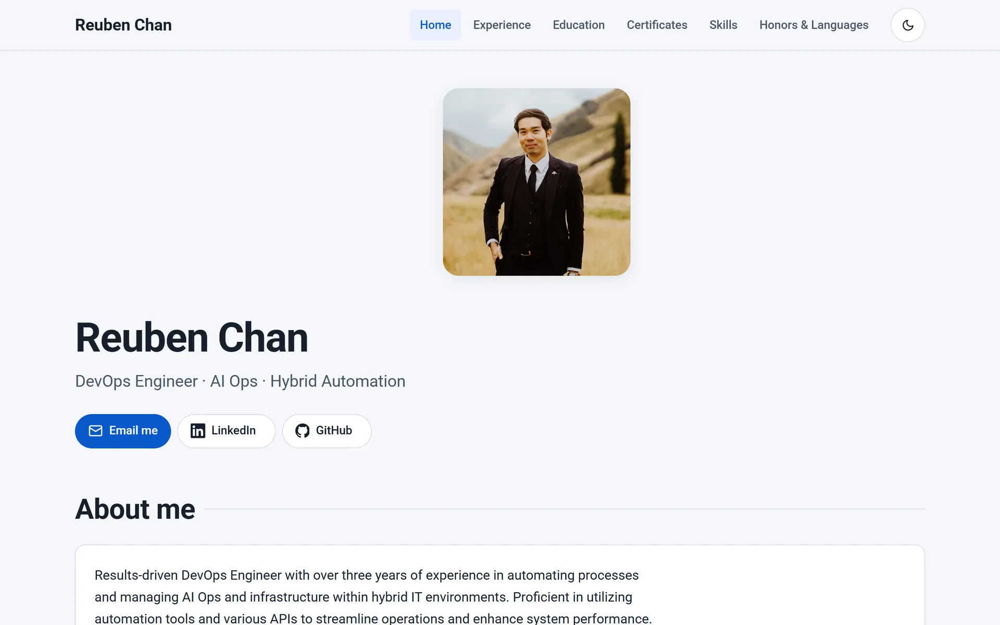
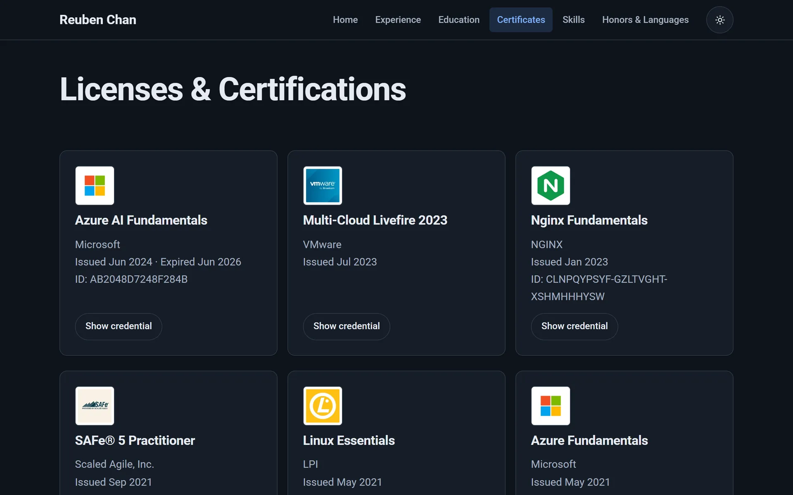
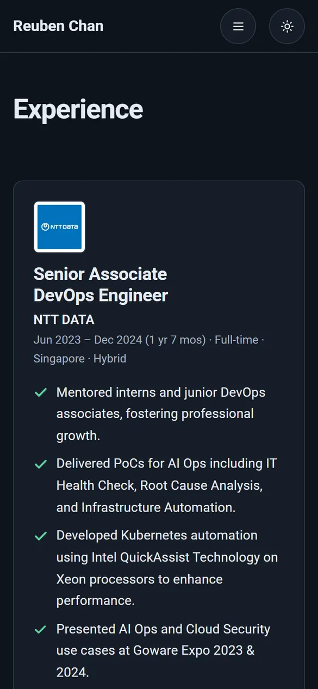

# Reuben Chan: Resume Website

[](https://github.com/ReubenChan/web_project/actions/workflows/ci.yml)

My personal resume site: experience, education, certifications, skills and awards.
It's a fast, accessible static site built with hand-written HTML, CSS and a little vanilla JavaScript. No frameworks, no build step and no third-party requests.

**Live site:** https://reubenchan.github.io/web_project/



| Certificates (dark theme) | Experience on mobile (dark theme) |
| --- | --- |
|  |  |

## Lighthouse

Every page scores **100** in all four categories on mobile and desktop. CI re-checks this on every pull request (see [CI/CD](#cicd)).

| | Performance | Accessibility | Best Practices | SEO |
| --- | :---: | :---: | :---: | :---: |
| All 6 pages | 100 | 100 | 100 | 100 |

Home page on Lighthouse's simulated mobile connection, before and after the rebuild:

| Metric | Before | After |
| --- | ---: | ---: |
| First Contentful Paint | 4.0 s | 1.0 s |
| Largest Contentful Paint | 4.5 s | 1.5 s |
| Cumulative Layout Shift | 0.002 | 0 |
| Total download size | 505 KB | 87 KB |

## Features

- Light and dark themes: follows the OS setting, with a toggle that remembers your choice
- Smooth page-to-page transitions (View Transitions API) in supporting browsers
- Responsive from 320 px phones to wide desktops, with no horizontal scrolling
- Fully usable by keyboard and screen reader, and with JavaScript turned off
- Rich link previews (Open Graph) and structured data for search engines

## Architecture decisions

### 1. Zero dependencies, no build step
The site used to load Bootstrap 3, Bootstrap 5, jQuery, Font Awesome and Google Fonts: about 400 KB of CSS and JavaScript for six pages. All of that is gone. Everything is served from this repo as plain files: one stylesheet ([style.css](style.css)), one ~2 KB script ([js/main.js](js/main.js)) and inline SVG icons.

With no build step, GitHub Pages can serve the repository exactly as committed. The trade-off is that the shared header and footer are repeated in each HTML file. For six pages, that's simpler than adding a static-site generator.

### 2. Design tokens with `light-dark()`
Every colour, spacing step, font size, radius and shadow is a CSS custom property in `:root`. Each colour is declared **once** with `light-dark(<light>, <dark>)`, and `color-scheme` decides which value applies:

- By default, `color-scheme: light dark` follows the OS setting.
- The theme toggle sets `data-theme="light"` or `"dark"` on `<html>`, which pins `color-scheme`.
- A three-line inline script in `<head>` applies the saved choice before first paint, so dark-mode visitors never see a white flash.

Every text/background pair was checked against WCAG AA (4.5:1) in both themes. Most pass AAA.

### 3. Layout: container queries and subgrid
- **Container queries (`@container`):** components respond to their own width, not the viewport. The home hero and the Experience job cards switch between side-by-side and stacked based on the space they're given. Viewport media queries are used only for page-level layout, such as collapsing the navigation.
- **Subgrid:** on the Certificates and Education pages each card spans four rows of the parent grid and adopts them with `grid-template-rows: subgrid`. Logos, titles, details and "Show credential" buttons therefore line up across every card in a row, whatever the text length.
- **The gotcha:** `container-type` applies layout containment, and layout containment silently disables subgrid. Cards in a subgrid therefore don't declare `container-type`.

### 4. Motion
- **Scroll-in effect:** pure CSS scroll-driven animation (`animation-timeline: view()`), with no JavaScript and no IntersectionObserver. Cards slide up but deliberately don't fade: a card resting at the bottom edge of the screen would otherwise stay semi-transparent and fail text contrast.
- **View Transitions, both kinds:**
  - `document.startViewTransition()` animates the same-page theme switch.
  - `@view-transition { navigation: auto; }` animates cross-page navigation. The header stays in place while the page title slides in.
- **Reduced motion:** everything is switched off for visitors who prefer reduced motion. Browsers without support simply show the content without animation.

### 5. Performance
- **Font:** a self-hosted variable Roboto (Latin subset, 43 KB), preloaded, with `font-display: swap`.
- **Images:** logos are 160 px WebP. The profile photo is responsive AVIF with a WebP fallback in a `<picture>`, cut from 108 KB to 4–10 KB, and preloaded with `fetchpriority="high"` because it's the largest element on screen.
- **Layout stability:** every image has explicit `width`/`height`, which prevents layout shift. Below-the-fold logos use `loading="lazy"`.
- **No third-party origins,** so there's nothing to `preconnect` to. The first paint depends only on this site's own files.

### 6. Accessibility
- Semantic landmarks: `<header>`, `<nav>`, `<main>`, `<section>`, `<article>` and `<footer>`, with one `<h1>` per page and headings in order.
- A skip link, and `aria-current="page"` on the active nav item.
- A mobile menu button with `aria-expanded`, closed with Escape.
- A theme toggle with `aria-pressed`.
- Icon-only links have accessible names. Links that open a new tab say so to screen readers.
- Visible `:focus-visible` outlines. Dates use `<time datetime>`.
- All content is visible without JavaScript. JS only adds the theme toggle and the mobile menu.

### 7. SEO
- A unique title and description on each page, plus canonical URLs.
- Open Graph/Twitter tags with a 1200×630 share image.
- JSON-LD `Person` structured data, `sitemap.xml` and `robots.txt`.

## Project structure

```
├── index.html, experience.html, education.html,
│   certificates.html, skills.html, honors_lang.html
├── style.css                 # tokens, base, layout, components, motion
├── js/main.js                # theme toggle + mobile nav
├── fonts/                    # Roboto variable font (SIL OFL, see OFL.txt)
├── images/                   # WebP/AVIF images + social share image
├── favicon.svg, robots.txt, sitemap.xml
├── docs/                     # README screenshots (not deployed)
├── lighthouserc.json         # Lighthouse CI thresholds
├── .htmlvalidate.json        # HTML validation rules
└── .github/
    ├── workflows/ci.yml      # validate → Lighthouse → deploy
    ├── scripts/lighthouse-summary.mjs
    └── dependabot.yml
```

## Run locally

Any static file server works. With Node.js installed:

```bash
npx http-server . -p 8080 -c-1
# open http://localhost:8080
```

Run the same checks as CI:

```bash
npx html-validate@11 "*.html"
npx @lhci/cli@0.15 autorun      # needs Chrome installed
```

## CI/CD

[.github/workflows/ci.yml](.github/workflows/ci.yml) runs on every pull request and every push to `main`:

| Job | What it does | Runs on |
| --- | --- | --- |
| **Validate HTML** | `html-validate` with the recommended rule set (80 rules, incl. accessibility checks) | PRs and `main` |
| **Lighthouse** | Lighthouse CI on every page, 3 runs each (median). Fails if Accessibility, Best Practices or SEO < 100, or Performance < 90. Posts a score table to the job summary and uploads the full HTML reports. | PRs and `main` |
| **Deploy** | Publishes the site files to GitHub Pages, **only if both checks pass** | `main` only |

Performance is held to ≥ 90 rather than 100 because shared CI machines add timing noise. The other three categories are deterministic, so they must be exactly 100.

Dependabot opens a monthly PR to keep the workflow's GitHub Actions up to date.

### Repository settings

- **Settings → Pages → Source:** GitHub Actions
- **Settings → Branches → `main`:** require the `Validate HTML` and `Lighthouse` checks to pass before merging

## Credits

- Font: [Roboto](https://github.com/googlefonts/roboto-classic), © The Roboto Project Authors, licensed under the SIL Open Font License 1.1 ([fonts/OFL.txt](fonts/OFL.txt)).
- Organisation logos belong to their respective owners.
- Content and photos © Reuben Chan.
